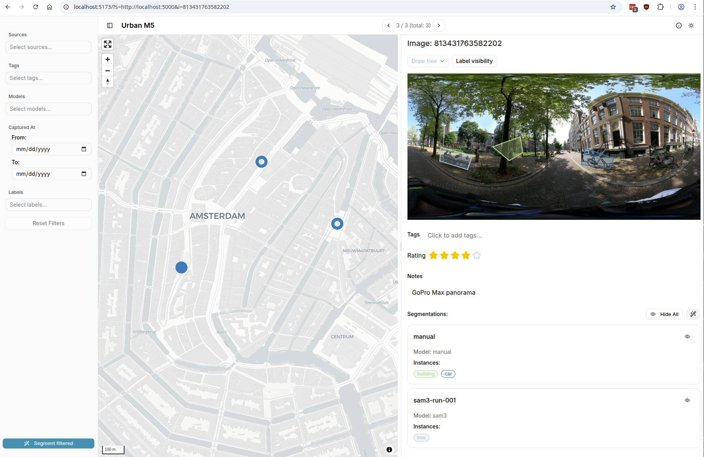

# streetscapes-explorer

[](https://github.com/Urban-M4/streetscapes-explorer/actions/workflows/quality.yml)

Web application to look at and change [streetscapes](https://github.com/stefanv/streetscapes) data.

Hosted at [https://urban-m4.github.io/streetscapes-explorer/](https://urban-m4.github.io/streetscapes-explorer/).



## Usage

In normal usage you would start the streetscapes server and than follow the link it prints.

```bash
pip install streetscapes[explorer]
streetscapes-explorer
```

# Development

```shell
pnpm i # install dependencies
pnpm dev # start development server
pnpm build # build for production
pnpm format # format code with prettier
pnpm lint # run eslint
pnpm typecheck # run TypeScript type checking
# When streetscapes explorer api changes, run:
pnpm api:generate
```
